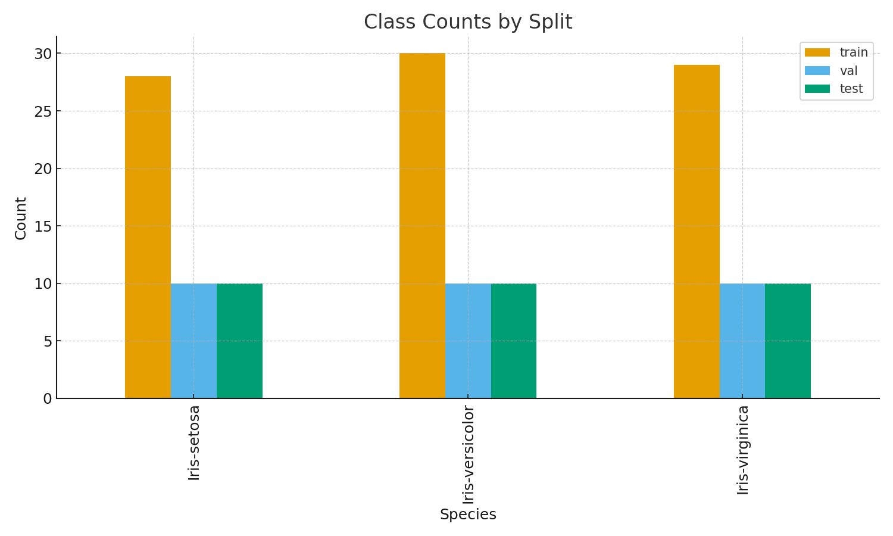
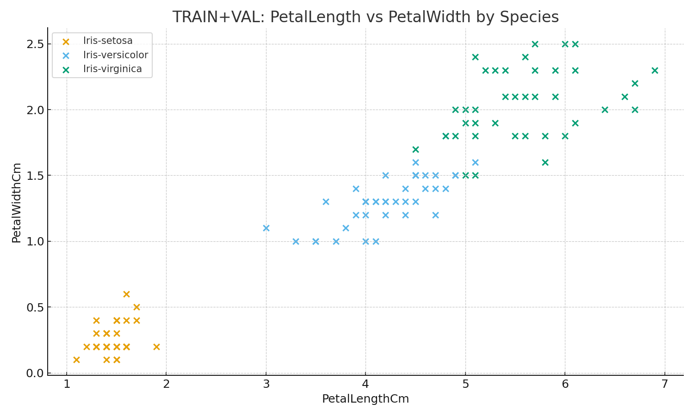
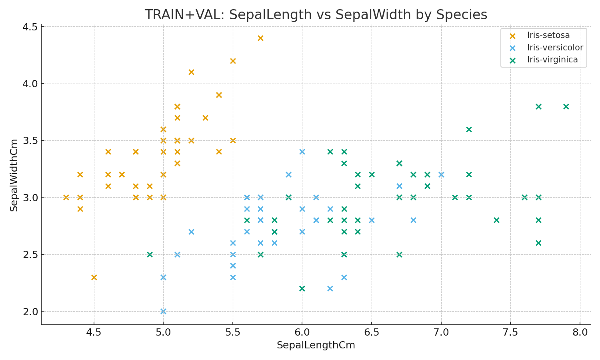
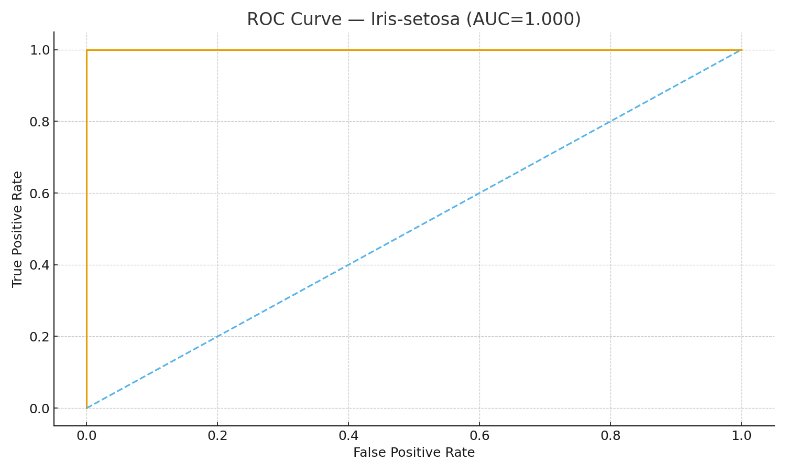
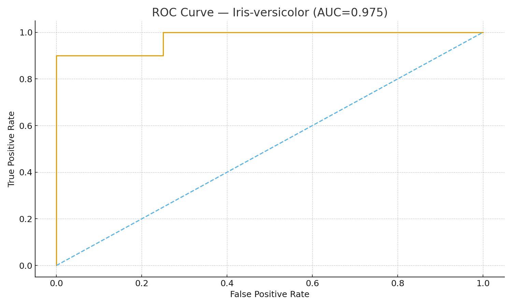
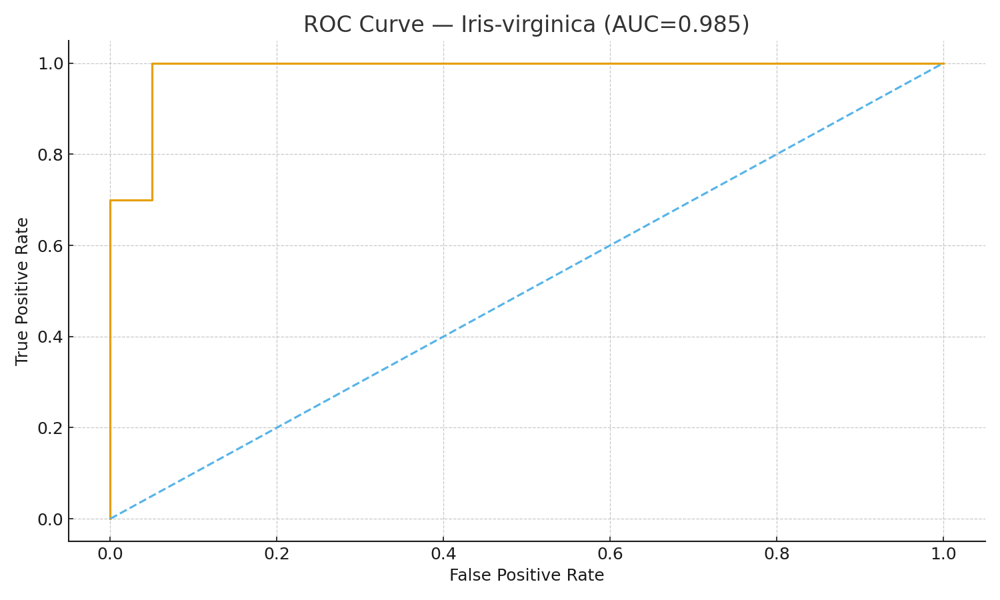
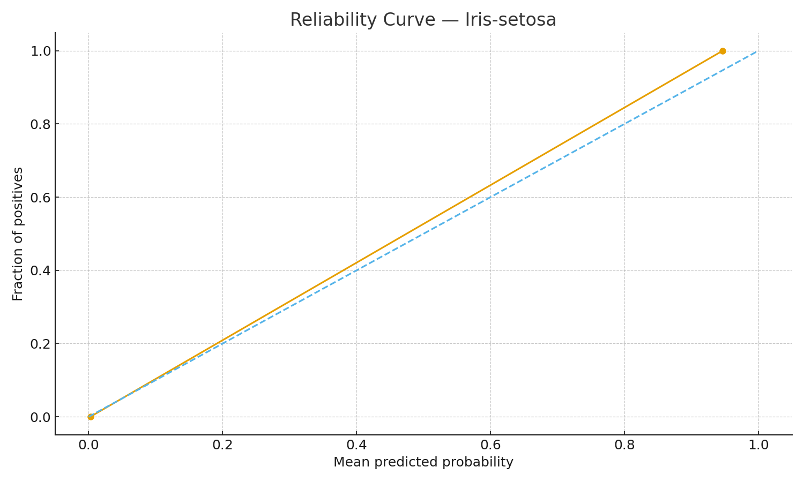
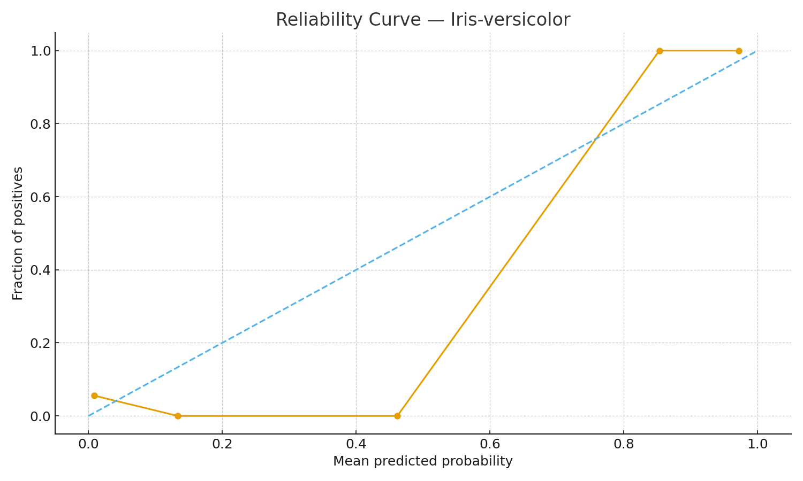
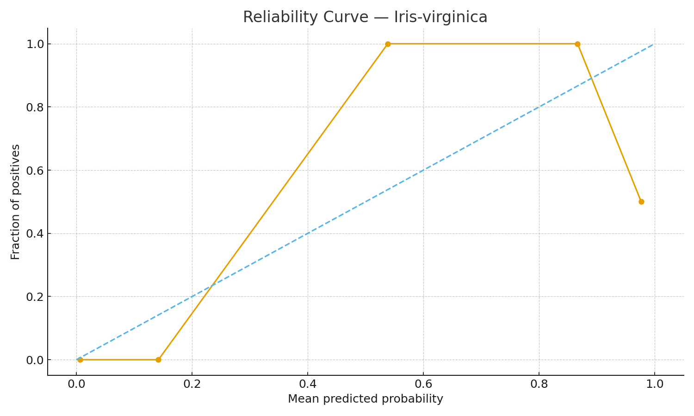

# From Raw Petals to Predictions: A KDD Walkthrough on the Iris Dataset

Medium Article - [https://medium.com/@akshatamadavi/unveiling-insights-a-practical-data-mining-project-walkthrough-f9d5fd688ce7]

**TL;DR**  
We follow the **KDD** process end‑to‑end (Sample → Select/Preprocess → Model → Evaluate/Interpret → Deploy) on the Iris dataset.  
Final model: **RandomForest**. Test performance: **accuracy = 0.967**, **macro‑F1 = 0.967**, **macro AUC = 0.987**.

---

## 1) Sample (Data Selection & Splitting)
- Source: `csv:/mnt/data/IRIS.csv`; fingerprint: `973d8d6ff5d9f62d113fa377b9dc2a4936cc353404f5108ff2056fc187b6a2e3`  
- Deduplicate rows on feature set; split **60/20/20** with `random_state=42` and **stratification**.



**Why this matters.** Stratification preserves class balance across splits, and dedup avoids the same flower landing in both train and test.

---

## 2) Selection, Preprocessing & Transformation
- Kept numeric features as-is (no standardization needed for trees).
- TRAIN‑only EDA, drift checks (KS/SMD), and multicollinearity (VIF) were performed to avoid leakage.

**Quick intuition plots (TRAIN+VAL):**





> Petal measurements separate the classes sharply; sepal features are less informative.

---

## 3) Modeling
- Evaluated families: Logistic Regression, SVC‑RBF, kNN, Decision Tree, **RandomForest**, and LogReg + SelectKBest.
- CV: **RepeatedStratifiedKFold(5 × 2)**, scoring **macro‑F1**, pipelines to prevent leakage.
- Winner: **RandomForest**. Frozen hyperparameters used for final training on **TRAIN+VAL**.

---

## 4) Evaluation & Interpretation (TEST only for metrics)
- Test metrics: **accuracy = 0.967**, **macro‑F1 = 0.967**, **macro AUC (OvR) = 0.987**, **micro AUC = 0.990**.

**Confusion Matrix (counts):**


**ROC Curves (one-vs-rest):**  







**Permutation Importance (VALIDATION):**


**Reliability / Calibration:**  







---

## 5) Deployment & Monitoring
- **Persisted pipeline** with metadata (`models/best_model.pkl`).
- **FastAPI** service with `/healthz`, `/readyz`, `/predict`, and a simple `/monitor/drift_check`.
- **Pinned environment** & Dockerfile for reproducible serving.
- **Baseline stats** (`monitoring/baseline.json`) for drift SMD checks.

---

## Reproducibility
- Seed: `42`; scikit‑learn pipeline ensures transformations happen inside CV/fit.
- Dataset fingerprint: `973d8d6ff5d9f62d113fa377b9dc2a4936cc353404f5108ff2056fc187b6a2e3`.  
- Code & artifacts are packaged in `kdd_iris_full_package.zip`.

---

## Appendix: Minimal Code Snippet (Serving)
```python
from fastapi import FastAPI
import joblib, pandas as pd

bundle = joblib.load("models/best_model.pkl")
pipe = bundle["pipeline"]
app = FastAPI()

@app.post("/predict")
def predict(item: dict):
    df = pd.DataFrame([item])
    proba = pipe.predict_proba(df)[0]
    classes = list(pipe.named_steps["clf"].classes_)
    return {"prediction": classes[int(proba.argmax())], "classes": classes, "probabilities": proba.tolist()}
```

*Publishing on Medium:* paste this Markdown and upload the images from `medium_assets/` when prompted by the editor. Title and TL;DR can be adjusted to your voice.

